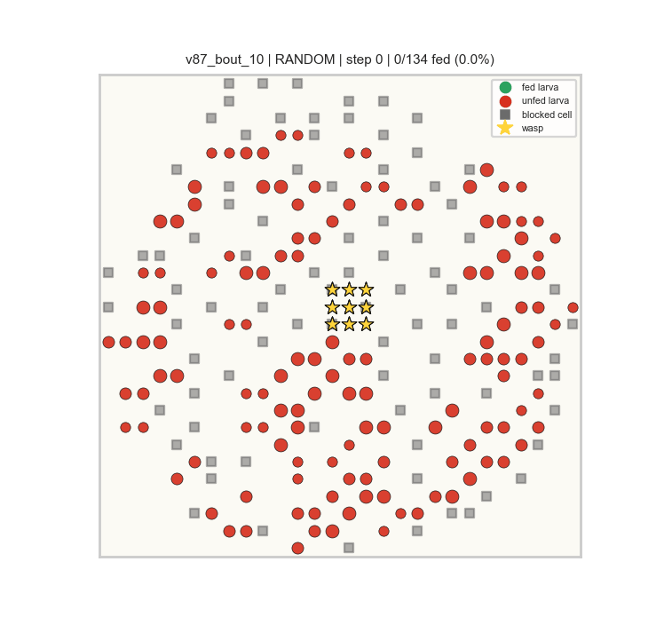
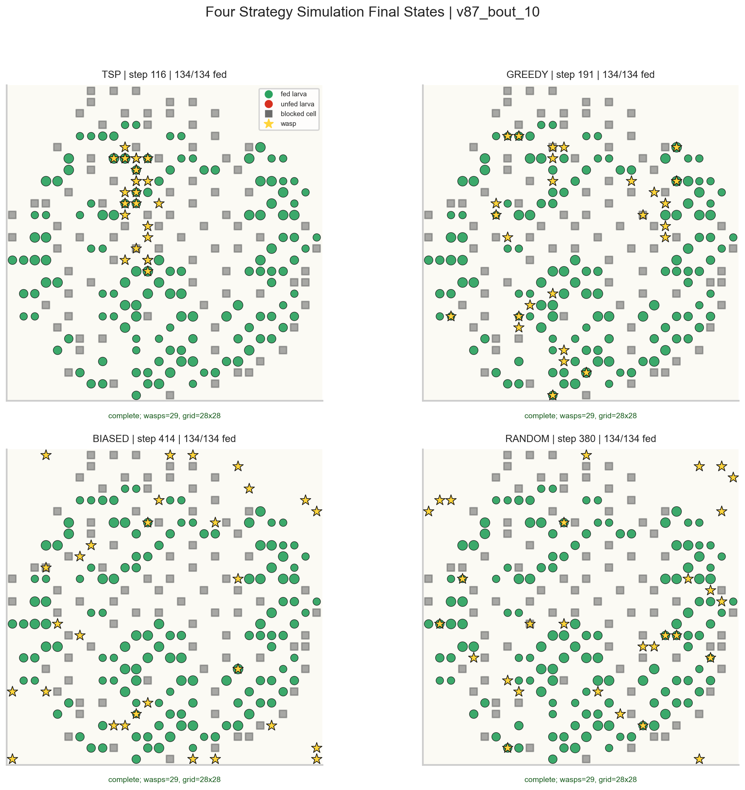

# Bio-Inspired Routing Optimization in Social Wasps

This project turns observed social-wasp nest and feeding-bout data into an agent-based routing benchmark. The core question is simple: if larvae are fixed across a nest and adult wasps must move through space to feed them, which movement rule feeds the colony fastest and with the least wasted travel? The final report notebook, `final_analysis.ipynb`, evaluates this question across every available nest and bout: 3 nests, 36 nest-bout scenarios, and 144 fair strategy simulations.

## Why This Project Matters

Larval feeding is both a biological care problem and a routing problem. Larvae differ by developmental stage, their hunger changes through time, and adult wasps must repeatedly choose where to move next. That makes the system a strong test bed for bio-inspired optimization: the model is grounded in real nest geometry, but the strategies can be compared under controlled simulation conditions.

The project is unique because it does not only animate one hand-picked example. It converts every observed nest-bout combination into a fair benchmark scenario, scales colony structure reproducibly, assigns hunger from biologically interpretable stage ranges, and then compares structured route planning against weaker local or random movement rules.

## Research Question

How do different wasp movement strategies perform when they are asked to feed the same synthetic larval colony under the same resources, grid size, and random seed?

The benchmark separates the observed data from the simulated decision rule:

- Observed data defines nest geometry, bout identity, activity level, spatial breadth, and observed worker count.
- Simulated hunger is assigned randomly by larval stage, not copied from feeding frequency.
- Strategy performance is measured by completion time, total movement, movement efficiency, and final average hunger.

## Dataset Description

The analysis expects two local CSV files:

| File | Role |
| --- | --- |
| `ED_FL_3nests1noC2.csv` | Nest-cell map with nest ID, cell coordinates, cell contents, developmental stage, and distance from center. |
| `ALL_FL_minmaj_final3noC2.csv` | Behavioral bout observations with nest ID, bout ID, behavior code, cell reference, and wasp ID. |

Datasets are intentionally not committed to this repository. Keep them locally in the project root when running the notebook or script.

## Modeling Approach

The model uses Mesa to simulate a nest as a 2D grid. Larvae are stationary agents placed from the nest-cell coordinates. Wasps are mobile agents that move one grid step at a time and attempt to feed larvae when they arrive at an occupied larval cell.

The final benchmark includes:

| Nest | Base larvae | Scaled larvae | Bouts |
| --- | ---: | ---: | ---: |
| `v14` | 34 | 68 | 10 |
| `v72` | 53 | 106 | 14 |
| `v87` | 67 | 134 | 12 |

Each nest is scaled by duplicating the larval map once with deterministic coordinate jitter. This preserves the original spatial layout while creating a larger synthetic colony for stress-testing routing strategies.

## Agent Behavior and Strategies

Four strategies are compared in every nest-bout scenario:

| Strategy | Meaning |
| --- | --- |
| `random` | Pure wandering baseline. Useful as a lower-bound control. |
| `biased` | Directionally persistent movement. Less chaotic than random, but still weakly informed. |
| `greedy` | Local priority rule that targets hungry, nearby, high-stage larvae while avoiding excessive target crowding. |
| `tsp` | Nearest-neighbor route-style benchmark that repeatedly builds a route over remaining unfed larvae. |

The `tsp` strategy is not a claim that real wasps solve the traveling-salesperson problem. It is used as a structured routing benchmark so the project can measure how valuable route organization is compared with local or random search.

## Synthetic Colony Scaling and Hunger Initialization

The simulation keeps the ground rules fixed:

- `SCALE_FACTOR = 2`
- `RANDOM_SEED = 42`
- fair benchmark horizon: `3000` steps
- wasps per scenario: `max(ceil(scaled_larvae / 5), observed_unique_wasps) + activity_bonus`
- activity bonus: `ceil(observed_feeding_events / 100)`

Initial hunger is generated from larval stage, not from `FL_freq`:

| Stage | Initial hunger range |
| --- | --- |
| `L1` | `0.20` to `0.50` |
| `L2` | `0.45` to `0.75` |
| `L3` | `0.65` to `1.00` |

This avoids circular logic: observed feeding frequency remains available as metadata, but it does not directly determine how hungry simulated larvae are.

## Key Results

The executed final notebook and the standalone script both reproduce the same overall ranking:

| Strategy | Runs | Finish rate | Median completion step | Median distance | Median final hunger | Median efficiency |
| --- | ---: | ---: | ---: | ---: | ---: | ---: |
| `tsp` | 36 | 1.00 | 67.0 | 2345.0 | 0.017 | 45.1 |
| `greedy` | 36 | 1.00 | 142.5 | 6137.0 | 0.118 | 17.3 |
| `biased` | 36 | 1.00 | 463.5 | 8353.5 | 0.286 | 12.5 |
| `random` | 36 | 1.00 | 529.0 | 11642.5 | 0.209 | 8.8 |

`TSP` wins all 36 nest-bout scenarios under the fair comparison. The important result is not just that it finishes first; it also uses far less movement and leaves larvae with the lowest final hunger. `Greedy` is a credible second-place method after target-crowding control, but local priority still cannot match route-level organization. `Biased` and `random` complete eventually, but they spend too much motion wandering.

## Playable Four-Strategy Simulations

The repository includes playable simulation exports for the same large `v87` scenario. Every strategy receives the same colony, wasp count, grid size, and scenario seed, so the movement differences come from the routing strategy itself.

### Playable GIFs

These render directly in GitHub:

| TSP | Greedy |
| --- | --- |
|  |  |

| Biased | Random |
| --- | --- |
|  |  |

### HTML Animations With Controls

The same animations are also exported as standalone Matplotlib HTML files:

- [`animations/simulation_tsp.html`](animations/simulation_tsp.html)
- [`animations/simulation_greedy.html`](animations/simulation_greedy.html)
- [`animations/simulation_biased.html`](animations/simulation_biased.html)
- [`animations/simulation_random.html`](animations/simulation_random.html)

GitHub does not execute notebook JavaScript the same way a local Jupyter session does, so the GIFs are included for direct README playback and the HTML files are included for local/browser playback with controls.

### Final-State Snapshot Summary



The point of these visual exports is accountability. The summary tables prove the benchmark result numerically, while the animations show that the simulation is actually placing larvae, wasps, blocked nest cells, and final feeding states in a biologically interpretable nest-like layout.

## Analysis Figures

The final notebook keeps only plots that support specific claims:

- Strategy scorecard across speed, distance, efficiency, and hunger.
- Full scenario heatmap showing completion step for every nest-bout and strategy.
- Delay plot showing how much slower each non-TSP method is compared with TSP on the same scenario.
- Nest-level bar chart checking whether the ranking holds across `v14`, `v72`, and `v87`.
- Efficiency frontier showing the tradeoff between speed and movement productivity.
- Bout difficulty audit connecting observed activity, spatial breadth, and colony size to simulated completion time.

Plots that only repeated "everything completed" or only visualized configuration choices were removed because they did not add scientific value.

## Repository Guide

| File | Purpose |
| --- | --- |
| `final_analysis.ipynb` | Main executed research notebook with tables, plots, selected animations, validation, and interpretation. |
| `wasp_routing_analysis.py` | Script version of the benchmark pipeline for reproducible command-line runs. |
| `figures/` | Exported four-strategy simulation plots used by the README. |
| `animations/` | Playable GIF and standalone HTML animations for the four movement strategies. |
| `generate_strategy_animations.py` | Script that regenerates the GIF/HTML animation assets from local CSV data. |
| `requirements.txt` | Python dependencies needed to run the notebook/script. |
| `.gitignore` | Prevents local datasets and generated outputs from being committed. |

Older prototype notebooks are intentionally not the main deliverable. The final notebook is the one to use for grading, presentation, and project review.

## How To Run Locally

1. Clone the repository.

```bash
git clone https://github.com/hemu77/Bio-Inspired-Routing-Optimization-in-Social-Wasps.git
cd Bio-Inspired-Routing-Optimization-in-Social-Wasps
```

2. Add the two CSV files locally in the repo root.

```text
ED_FL_3nests1noC2.csv
ALL_FL_minmaj_final3noC2.csv
```

3. Install dependencies.

```bash
python -m pip install -r requirements.txt
```

4. Run the script benchmark.

```bash
python wasp_routing_analysis.py --output-dir outputs
```

5. Regenerate playable strategy animations if needed.

```bash
python generate_strategy_animations.py --output-dir animations
```

6. Or open the notebook.

```bash
jupyter lab final_analysis.ipynb
```

## Validation Checks

The final notebook includes a validation cell confirming:

- total nests analyzed: `3`
- nests: `v14`, `v72`, `v87`
- total scenarios: `36`
- total fair simulations: `144`
- best overall strategy: `tsp`
- still-incomplete runs after extension: `0`

The script was also run locally and reproduced:

- scenarios: `36`
- fair simulations: `144`
- best strategy: `tsp`
- median TSP completion step: `67`

## Limitations

This is a simulation benchmark, not a complete biological reconstruction.

- Hunger growth and feeding drops are stylized rules, not directly fit from continuous physiological measurements.
- The grid approximates the nest geometry rather than preserving exact continuous motion.
- The `tsp` method is an optimization benchmark, not a literal cognitive model of wasps.
- The current result uses one random seed for the final benchmark; future work should add multi-seed confidence intervals.
- Wasp roles are simplified into forager, unloader, and feeder categories.

## Next Improvements

Strong next steps would be:

- run repeated seeds and report uncertainty intervals,
- calibrate hunger dynamics using bout timing,
- test additional biologically plausible routing heuristics,
- add continuous-space movement instead of grid movement,
- compare observed worker paths directly with simulated strategy paths,
- package the model as a small reusable simulation library.
