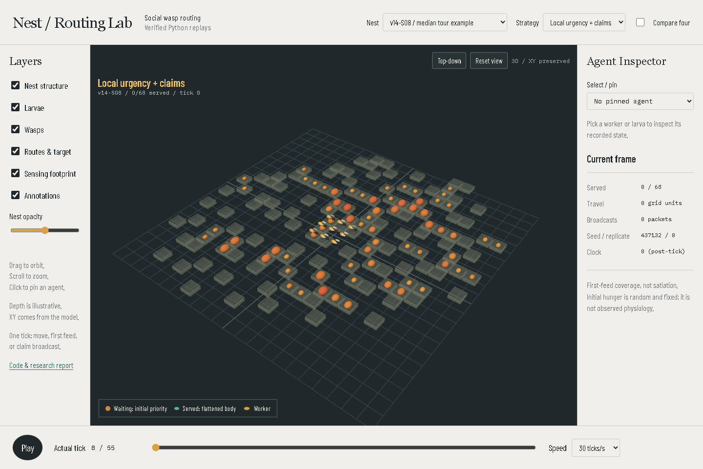
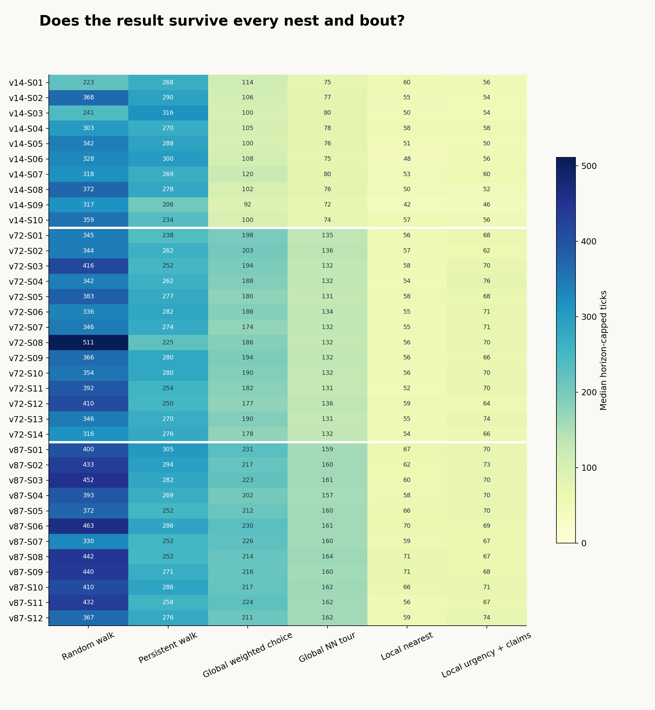

# Nest / Routing Lab
### Bio-Inspired Routing Optimization in Social Wasps

**[Open the interactive lab](https://hemu77.github.io/Bio-Inspired-Routing-Optimization-in-Social-Wasps/) | [Executed research notebook](final_analysis_v2.ipynb) | [Verification gates](docs/ACCEPTANCE.md)**

An agent-based project asking how movement, local information and worker coordination change the effort needed to serve a colony. Three observed nest layouts support 36 synthetic nest-bout scenarios. Six policies, ten paired replicates and two controlled ablations produce **2,880 simulations**. A layered 3D workstation makes recorded decisions inspectable, rather than merely animated.

> Research-v2 measures **first-feed coverage**, not satiation. Random initial hunger is an assumed priority, not measured physiology. Depth is illustrative; XY comes from the mapped simulation.



## Why This Project Matters

Distributed groups can finish shared tasks without a central dispatcher. Wasp feeding makes that idea concrete: many workers must find many larvae, and reaching nearby targets is not the same as covering the whole nest efficiently. The engineering analogy includes inspection, service routing and multi-agent allocation. This project does **not** establish that real wasps use these algorithms.

## Research Question And Goal

**With matched starting conditions and action budgets, what trade-offs appear between whole-colony coverage, movement, waiting and communication?**

Success means every synthetic larva receives its first feed. Runs stop at success or 3,000 ticks. Incomplete main runs receive a separate 10,000-tick pass, never mixed into the fair ranking. All 2,160 executed main runs finished, so no extended pass was needed.

## Dataset Description

Two private files are needed only to regenerate experiments:

| Local file | Contribution | Does not establish |
|---|---|---|
| `ED_FL_3nests1noC2.csv` | Cell coordinates, contents and stages | True initial hunger or 3D structure |
| `ALL_FL_minmaj_final3noC2.csv` | Nest/bout groups, worker counts and activity summaries | Validation of simulated trajectories |

| Nest | Bouts | Original larvae | Synthetic larvae | Grid width |
|---|---:|---:|---:|---:|
| v14 | 10 | 34 | 68 | 22 |
| v72 | 14 | 53 | 106 | 25 |
| v87 | 12 | 67 | 134 | 28 |

The inherited event grouping (`FL`, `FL2`, `LPL`, `SPL`) is an **assumed activity proxy** for resource scaling until a behavioral codebook is confirmed. Public scenarios use ordinal labels such as `v87-S06`; original bout labels and worker identities are not exported. Derived summaries and selected synthetic traces are public. **Raw CSV datasets are not published.**

## Modeling Approach

An agent-based model tracks individual larvae and workers. Larvae remain in cells; workers move on a bounded square grid. All workers can feed. Food availability, role specialization and foraging trips are outside this experiment. Background cells remain traversable.

One activation permits one cardinal move, one first feed at the current cell, **or** one claim broadcast. Feeding and broadcasting replace movement; neither is free. Initialization, scheduling and policy choices use independent random streams. Policies inside a scenario-replicate receive the same colony, resources, grid and scheduler seed. Extra policy random draws cannot change activation order.

Unfinished runs have `completion_step: null` and `stop_reason: "horizon"`. Horizon-capped time includes failures at 3,000; travel is measured in cardinal grid units, not metabolic energy. Restricted waiting ends at first feed or the censoring horizon.

## Agent Behavior And Strategies

| Identifier | Information | Actual rule |
|---|---|---|
| `random` | Blind | Independent cardinal random walk |
| `biased` | Blind | Persistent direction; 25% chance to redraw |
| `greedy` | Global | Stochastic target weighted by initial priority / (1 + Manhattan distance) |
| `tsp` | Global | Nearest-neighbour tour; historical name, **not an optimal TSP solver** |
| `local_nearest` | Local | Nearest observed or remembered target; explore otherwise |
| `local_urgency_claims` | Local | Observed priority / (1 + distance), with expiring local claims |

Local sensing and communication use Manhattan radius 3. Bounded memory stores at most 256 observed locations, served states and priorities. Workers explore least-visited neighbors when no target is known. Claims expire after 8 ticks, with renewal considered every 4; lower worker IDs resolve received conflicts.

Two urgency ablations disable claims or enable global sensing. Local nearest versus urgency without claims additionally exposes priority selection. Information classes differ: a comparison across classes cannot isolate routing alone.

## Synthetic Scaling And Hunger

`SCALE_FACTOR=2` duplicates each original larva once with deterministic coordinate jitter and collision-resolved grid placement. Added larvae are synthetic; quantized grid locations are not raw physical coordinates.

| Stage | Uniform initial priority |
|---|---|
| L1 (i1/i2) | [0.20, 0.50] |
| L2 (i3/i4) | [0.45, 0.75] |
| L3 (i5) | [0.65, 1.00] |

Initial hunger stays fixed. `FL_freq` never drives it; a regression test changes frequency values and checks identical initialization. Seed 42 anchors deterministic derived seeds; ten replicates vary assumptions in paired experiments.

The retained staffing rule is `max(ceil(larvae/5), observed workers) + ceil(grouped activity events/100)`. This is an engineering workload assumption, not a calibrated biological staffing law.

## Key Results And Interpretation

Ranking sorts reliability first, then median horizon-capped time, then median movement per served larva. Each policy has 360 fair runs.

| Policy | Completed | Median ticks | Median travel / served | Median priority-weighted wait |
|---|---:|---:|---:|---:|
| Local nearest | 100% | 57 | 11.55 | 21.29 |
| Local urgency + claims | 100% | 67 | 10.39 | 25.11 |
| Global NN tour | 100% | 133 | 28.25 | 60.96 |
| Global weighted choice | 100% | 190 | 40.01 | 90.74 |
| Persistent walk | 100% | 268 | 46.62 | 48.60 |
| Random walk | 100% | 367.5 | 77.66 | 78.72 |

**No unconditional coordination win:** local nearest is faster. Urgency with claims travels less but waits longer; its median time is 67 versus 60 without claims. Charging communication an action exposes that trade-off. These are conditional simulation results, not biological population claims or proof of an optimal algorithm.

Six figures answer explicit questions: coverage dynamics, reliability/capped time, travel per served larva, restricted waiting, all-scenario robustness and coordination-cost ablations. Replicate envelopes are conditional stochastic variability, **not biological confidence intervals**. Unsupported composite difficulty and redundant four-point frontiers were removed from v2.



## Why This Is Distinctive

The contribution is an **auditable experiment-to-replay workflow**, not decorative 3D. Every visible feed, target, claim and decision reason comes from the benchmark's Python engine. Paired scheduler streams, local observations, message cost, timeout handling and negative ablation findings make assumptions inspectable. The reader can question what an agent could know, not just watch motion.

Six layers control nest structure, larvae, workers, routes/targets, sensing and annotations. Pin by clicking or by keyboard-accessible entity selector; hidden pins remain identified, and overlapping workers have explicit selection. Camera state persists through seek/playback. Four-method comparison uses one renderer and one **actual tick** clock; finished methods hold their final state. Interactive 2D fallback retains playback, layers, picking and inspection.

## Notebook And Code Guide

| File | Responsibility |
|---|---|
| `final_analysis_v2.ipynb` | Executed teaching report: data, assumptions, results, four replays, six figures and validation |
| `research_model.py` | Research actions, policies, metrics and trace contract |
| `run_research.py` | Sequential, resumable experiments and anonymized trace export |
| `research_report.py` | Figures and interpretations; no duplicate simulation |
| `research_results.json` | Derived summaries and per-tick metrics |
| `validate_research.py` | Counts, pairing, provenance and replay/result consistency |
| `web/` | TypeScript, Vite, Three.js workstation and browser checks |
| `wasp_routing_analysis.py` | Unchanged legacy engine and reused preprocessing/placement |
| `final_analysis.ipynb` | Previous report, retained as legacy |

The original four GIF/HTML exports remain in `animations/` and belong to **legacy-v1**, not the new endpoint. GitHub sanitizes notebook JavaScript/iframes: open the live lab for v2 playback. Local Jupyter renders the live iframe embeds.

**Play the four original methods with research-v2 rules:** [NN tour](https://hemu77.github.io/Bio-Inspired-Routing-Optimization-in-Social-Wasps/?scenario=v87-S06&strategy=tsp), [persistent walk](https://hemu77.github.io/Bio-Inspired-Routing-Optimization-in-Social-Wasps/?scenario=v87-S06&strategy=biased), [random walk](https://hemu77.github.io/Bio-Inspired-Routing-Optimization-in-Social-Wasps/?scenario=v87-S06&strategy=random), [global weighted choice](https://hemu77.github.io/Bio-Inspired-Routing-Optimization-in-Social-Wasps/?scenario=v87-S06&strategy=greedy), or [synchronized comparison](https://hemu77.github.io/Bio-Inspired-Routing-Optimization-in-Social-Wasps/?scenario=v87-S06&compare=1).

## Run Locally

Verified with Python 3.11 and Node.js 24; scientific packages are pinned and npm dependencies locked.

```powershell
python -m venv .venv
.venv\Scripts\Activate.ps1
python -m pip install -r requirements.txt
python -m unittest test_research_model -v
python validate_research.py
python execute_research_notebook.py
jupyter lab final_analysis_v2.ipynb
```

The report runs without private data. To regenerate experiments, place the two CSV files beside the scripts:

```powershell
python measure_smoke.py
python run_research.py
python research_report.py
python build_research_notebook.py
python execute_research_notebook.py
```

Atomic checkpoints under ignored `outputs/` resume compatible tasks. Changed source, geometry or scenario configuration invalidates the key. One simulation worker is intentional on the 16 GB laptop.

```powershell
cd web
npm ci
npm run build
npm test
npm run dev
```

Local browser tests use installed Chrome; CI installs Chromium. Add `?2d=1` to test fallback. Space plays/pauses and arrow keys step when focus is outside form controls. There is no autoplay or mandatory camera animation.

## Verification And Device Budget

- [x] Legacy reproduced: 144 runs; NN-tour median 67, greedy 142.5, persistent 463.5, random 529.
- [x] Nine public synthetic checks cover actions, feed-once, memory, claims, broadcast cost, RNG pairing, repeatability, censoring and frequency independence.
- [x] 2,160 fair runs plus 720 ablations; all fair runs completed.
- [x] Browser checks cover playback, seeking, four-method clock, hidden pins, orbit-vs-click, disposal, mobile and fallback.
- [x] Dependency audit, locked build and private-data exclusion.

Initial 18-run smoke: 4.0 seconds, measured peak Python RSS 217.4 MiB. Observed full-run Python RSS reached 328 MiB. A local playback sample measured 24 renders/s and about 25 MiB **JS heap**, not total browser process memory. Rendering is capped at 30 Hz, DPR at 1.5, hidden tabs pause, and old geometry is disposed. Hosted software-WebGL CI does not certify laptop FPS.

## Limitations And Next Improvements

There is no measured hunger, calibrated physiology, realistic food transport, collision avoidance or biological 3D geometry. Synthetic replicas and reused layouts reduce generalizability; only three real nests are represented. Event interpretation and worker scaling need domain confirmation. Priority-weighted wait is an assumed objective, not measured welfare.

Next: confirmed behavioral codebook, held-out nests, measured feeding timestamps, prespecified radius/resource sensitivity tests and calibrated transport. Learned policies and richer geometry should follow evidence that they answer a research question, not visual complexity alone.

Legacy results and the original PDF remain preserved at [legacy-v1](https://github.com/hemu77/Bio-Inspired-Routing-Optimization-in-Social-Wasps/tree/legacy-v1).
