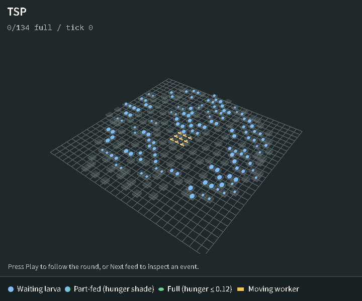
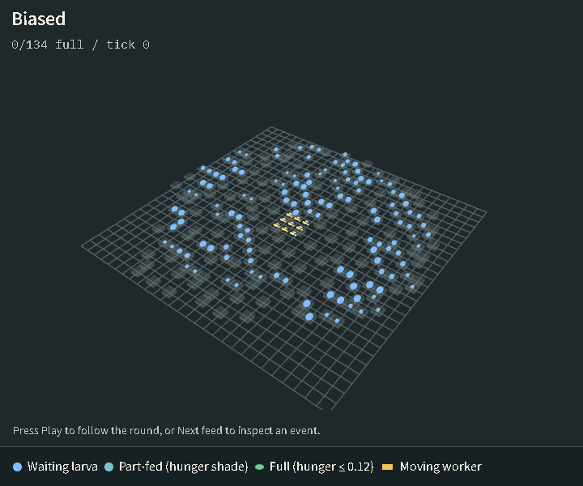
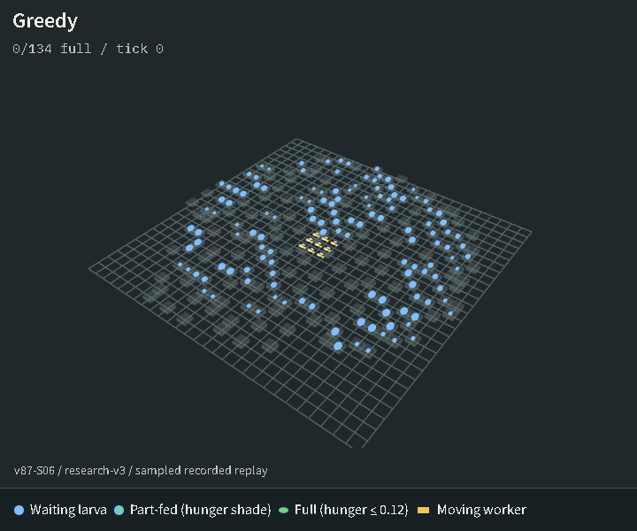
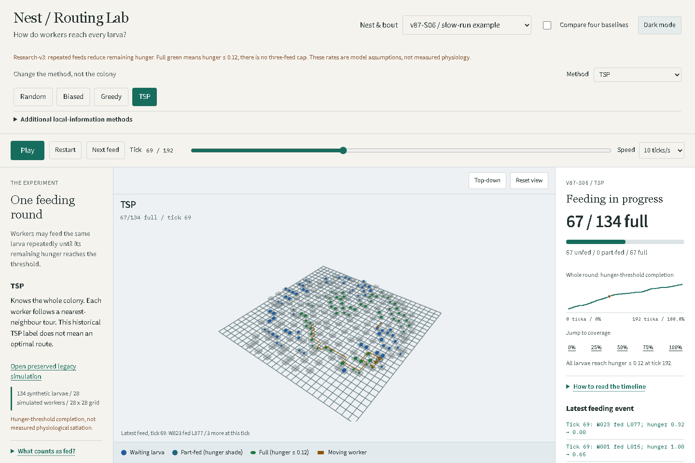

# Nest / Routing Lab
### Bio-Inspired Routing Optimization in Social Wasps

**[Open the lab](https://hemu77.github.io/Bio-Inspired-Routing-Optimization-in-Social-Wasps/) | [Executed report](final_analysis_v3.ipynb) | [Verification](docs/ACCEPTANCE.md)**


A dataset-grounded agent experiment: how do searching workers finish feeding a colony when larvae may need several feeds? Three observed nest layouts supply 36 synthetic nest-bout scenarios. Six policies, ten paired replicates and two ablations produce **2,880 executed simulations**. The browser replays recorded Python states, not a second model.

> Research-v3 marks a larva full only when remaining hunger is **at most 0.12**. There is **no three-feed cap**. Hunger, portions and recovery rates are assumptions, not measurements of biological satiation or food mass.

## Four Methods. One Colony.

**Same nest, same starting hunger, same 28 workers. Different routing decisions.**
These looping previews replay the complete validated `v87-S06` round in the actual
3D viewer. Blue larvae have not been fed; intermediate shades are partly fed;
solid green means remaining hunger <= 0.12. Gold agents are workers.

| TSP | Biased |
|:---|:---|
| [](https://hemu77.github.io/Bio-Inspired-Routing-Optimization-in-Social-Wasps/?scenario=v87-S06&strategy=tsp) | [](https://hemu77.github.io/Bio-Inspired-Routing-Optimization-in-Social-Wasps/?scenario=v87-S06&strategy=biased) |
| **Random** | **Greedy** |
| [](https://hemu77.github.io/Bio-Inspired-Routing-Optimization-in-Social-Wasps/?scenario=v87-S06&strategy=random) | [](https://hemu77.github.io/Bio-Inspired-Routing-Optimization-in-Social-Wasps/?scenario=v87-S06&strategy=greedy) |

Each preview holds its fully completed state before looping. Frames are evenly
sampled and accelerated to keep the README lightweight: **GIF playback speed is
not a method-speed comparison**. Read the actual tick counters and benchmark
results below. Click any preview to inspect, pause or scrub that method in the lab.
3D depth is illustrative; XY positions and feeding states come from recorded runs.

## Read The Simulation

Dark mode covers the entire interface. **Light mode** changes panels, controls, canvas and agent shades together. The preference is saved when browser storage is available. Switching never resets time, layers, selection or camera.

**Blue: no feed yet. Blue-to-green gradient: partly fed, still hungry. Solid green: threshold reached. Gold: worker.** Partial color follows `1 - remaining_hunger`; it can move back toward blue as hunger recovers. It is not cumulative food consumption. Completed larvae also flatten. Pin a larva to see remaining hunger, feed count, first-feed time and completion time.

Choose **TSP, Biased, Random or Greedy**; local-information extensions are separately disclosed. Comparison shares actual model time and holds completed methods at their final frame. **Next feed** includes repeat feeds. Milestones and the staircase count full larvae, not larvae merely visited once.

Drag to orbit; **Shift-drag or right-drag to pan**. Touch supports two-finger pan/pinch. Mouse-wheel zoom focuses on the pointer within each render region, excluding titles. **Reset view** fits and recenters the nest without resetting playback. Zooming crops the enlarged field by design; pan to inspect its other parts. Controls and legend never overlay rendered agents.



## Why This Matters

Distributed allocation appears in colony behavior, inspection and service routing. Reaching a nearby target is different from completing the colony. Charging feeding and communication an action makes that trade-off inspectable. This project does not establish that real wasps use these algorithms.

## Research Question

**With paired starting conditions, how do information, repeated feeding and coordination change completion time, movement and waiting?**

Fair runs stop at full threshold coverage or 3,000 ticks. Incomplete main runs would receive a separate 10,000-tick pass, never mixed into fair rankings. All 2,160 newly executed fair runs completed; no extended pass was needed.

## Datasets And Grounding

| Private local file | Contribution | Does not establish |
|---|---|---|
| `ED_FL_3nests1noC2.csv` | Coordinates, cell contents and stages | Measured hunger or 3D biology |
| `ALL_FL_minmaj_final3noC2.csv` | Nest/bout groups, observed worker counts and activity summaries | Validation of synthetic motion or feeding |

| Nest | Bouts | Original larvae | Scaled larvae | Grid width |
|---|---:|---:|---:|---:|
| v14 | 10 | 34 | 68 | 22 |
| v72 | 14 | 53 | 106 | 25 |
| v87 | 12 | 67 | 134 | 28 |

The inherited grouping `FL`, `FL2`, `LPL`, `SPL` is an assumed activity proxy for staffing until a codebook is confirmed. It does not supply food stock or synthetic feeding events. Public ordinal scenario labels hide original bout and worker identities. **No raw CSV datasets are published.**

Local preprocessing verified exact equality of all 36 public bout records and three inventories with the saved report. Public readers cannot independently audit withheld raw files. The source digest identifies Python code, not raw-data bytes or every browser asset. Reproducibility is not biological calibration.

## Model And Hunger Rules

Each original larva is duplicated once with deterministic jitter and collision-resolved grid placement. Extra agents and mapped positions are synthetic. Initial hunger is independently uniform by stage; `FL_freq` never sets it.

| Stage | Random initial hunger | Growth / hungry tick | Reduction / feed |
|---|---|---:|---:|
| L1 (i1/i2) | [0.20, 0.50] | 0.020 | 0.35 |
| L2 (i3/i4) | [0.45, 0.75] | 0.028 | 0.45 |
| L3 (i5) | [0.65, 1.00] | 0.035 | 0.55 |

Hunger grows once before each activation round, capped at 1. Feeding reduces it, floored at 0. Larvae stay eligible until hunger reaches 0.12 or less, regardless of feed count. Full larvae stop recovering hunger within this **single round**; subsequent nutritional cycles are not modeled.

Ten deterministic replicate seeds vary initial hunger. All policies within a scenario-replicate share the initial colony, hunger, staffing and scheduler seed. Staffing is `max(ceil(larvae/5), observed workers) + ceil(grouped activity events/100)`, an engineering assumption, not a biological staffing law.

One worker action is a cardinal move **or** a feed **or** a broadcast. Feeding takes place at the worker's starting cell. Several workers can feed one still-hungry larva in scheduler order in a tick, but never after completion. There is no collision avoidance, food depot, portion transport or metabolic energy model. Ticks are not seconds.

## Movement Policies

| Method | Information | Rule |
|---|---|---|
| Random | Blind | Independent cardinal random walk |
| Biased | Blind | Persistent direction; 25% redraw probability |
| Greedy | Global | Stochastic target weighted by remaining hunger / (1 + Manhattan distance) |
| TSP | Global | Nearest-neighbour tour; historical name, not an optimal TSP solver |
| Local nearest | Local | Nearest observed/remembered hungry target; exploration otherwise |
| Local urgency + claims | Local | Observed hunger / (1 + distance), with expiring local claims |

Local sensing/communication radius is three Manhattan moves. Memory holds at most 256 observed records, not unseen global state. Claims expire after eight ticks; renewal is considered every four. Lower worker IDs resolve received conflicts. Broadcasting costs an action. Activation permutations use a separate RNG stream from policy choices.

## Newly Executed Results

Rank reliability first, then median horizon-capped time, then median movement per completed larva. Each strategy has 360 fair runs.

| Strategy | Completed | Median ticks | Median travel / completed larva | Initial-hunger-weighted wait |
|---|---:|---:|---:|---:|
| Local urgency + claims | 100% | 74 | 10.59 | 29.79 |
| Local nearest | 100% | 79 | 15.04 | 28.36 |
| TSP | 100% | 173.5 | 34.70 | 72.80 |
| Greedy | 100% | 208 | 42.69 | 99.80 |
| Biased | 100% | 278.5 | 46.76 | 53.80 |
| Random | 100% | 389.5 | 79.60 | 83.28 |

Unlike first-feed v2, local urgency now ranks ahead of local nearest by median completion time and movement; its initial-hunger-weighted wait is slightly higher. This is conditional simulation evidence, not a universal coordination win. Claims-off/global-sensing ablations remain separate.

Six figures address threshold coverage, reliability/time, travel per full larva, restricted waiting until completion, every scenario, and communication cost. Unfinished waits are censored at the fair horizon. Replicate envelopes are stochastic variability conditional on these layouts, not biological confidence intervals. Wait weights use initial hunger, not terminal hunger.

## What Is Distinctive

The contribution is not decorative 3D. One audited engine connects results, readable analysis and inspectable events. Partial feeds and completion are separate; communication has a cost; local information stays local; paired replicates prevent scheduler confounding; failures cannot become cosmetic completed animations. Public synthetic checks require no private datasets. Depth is illustrative; XY is exactly the simulation's mapped geometry.

## Notebook And Code Guide

| Artifact | Role |
|---|---|
| `final_analysis_v3.ipynb` | Executed all-nest report, four replay links and six figures |
| `research_model.py` | Actions, hunger, policies, metrics and schema-2 snapshots |
| `run_research.py` | Sequential/resumable experiments and replay exports |
| `research_report.py` | Figures from saved results; no second simulation |
| `validate_research.py` | Pairing, provenance, action/event and hunger-transition checks |
| `export_viewer_context.py` | Selected bout metadata checked against all 24 replays |
| `web/` | Three.js viewer, fallback, themes and browser checks |

The notebook proceeds through context, data, synthetic construction, hunger rules, actions, benchmark/ablations, playable simulations, six analysis questions, limits and validation. GitHub sanitizes notebook JavaScript/iframes: use the live lab for playback.

## Run Locally

Verified with Python 3.11 and Node.js 24; requirements are pinned and npm dependencies locked.

```powershell
python -m venv .venv
.venv\Scripts\Activate.ps1
python -m pip install -r requirements.txt
python -m unittest test_research_model -v
python validate_research.py
python execute_research_notebook.py
jupyter lab final_analysis_v3.ipynb
```

Derived reports run without private files. To regenerate, put both private CSV files beside the scripts without committing them:

```powershell
python run_research.py
python export_viewer_context.py
python research_report.py
python build_research_notebook.py
python execute_research_notebook.py
cd web
npm ci
npm run build
npm test
npm run dev
```

To regenerate the README GIFs, leave that local server running and run
`python export_readme_gifs.py` from the repository root in another terminal.
The exporter uses installed Google Chrome and the same Three.js viewer, captures
90 recorded states per method, and verifies the terminal hunger state and
infinite-loop GIF metadata. Capture files stay in ignored `outputs/`; only the
four finished GIFs and their sampling manifest are published.

Ignored `outputs/` checkpoints resume only compatible source/geometry/scenario configurations. One simulation worker keeps the 16 GB workload bounded. Rendering uses one WebGL context, DPR at most 1.5 and a 30 Hz cap; hidden tabs pause. Local sampling measured 25 renders/s and about 39 MiB JS heap, not total browser RAM. Use `?2d=1` for fallback; orbit/pan/zoom require WebGL.

## Versions And Limitations

Preserved notebook-era players, unchanged: [TSP](https://hemu77.github.io/Bio-Inspired-Routing-Optimization-in-Social-Wasps/legacy/simulation_tsp.html), [Biased](https://hemu77.github.io/Bio-Inspired-Routing-Optimization-in-Social-Wasps/legacy/simulation_biased.html), [Random](https://hemu77.github.io/Bio-Inspired-Routing-Optimization-in-Social-Wasps/legacy/simulation_random.html), [Greedy](https://hemu77.github.io/Bio-Inspired-Routing-Optimization-in-Social-Wasps/legacy/simulation_greedy.html).

[legacy-v1](https://github.com/hemu77/Bio-Inspired-Routing-Optimization-in-Social-Wasps/tree/legacy-v1) preserves the earlier report. [research-v2-first-feed](https://github.com/hemu77/Bio-Inspired-Routing-Optimization-in-Social-Wasps/tree/research-v2-first-feed) preserves the first-feed model, results and viewer. V3 restores inherited hunger growth/portion reductions but removes the three-feed cap at the user's request. It retains v2's one-cardinal-action budget, so it is not identical to the prototype. Old notebooks require their matching archived code; endpoints across versions are not directly comparable.

Only three observed layouts exist. Duplication, uncalibrated rates, unlimited feeding and absorbing completion limit biological interpretation. Next: confirm the codebook, calibrate hunger/portions, test held-out nests and preregister sensitivity checks before claiming biological realism.
