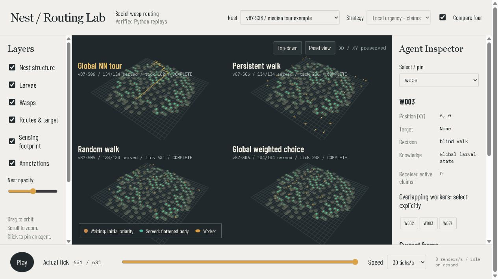
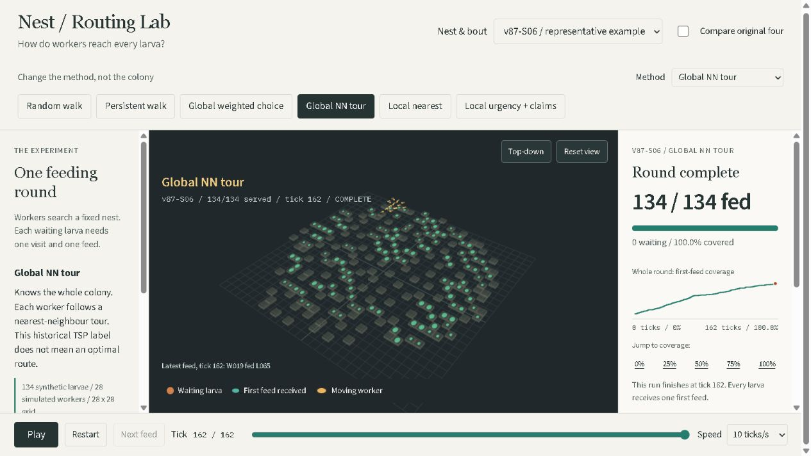

# Upgrade Gates

Checkboxes become checked only after evidence is recorded. RED means failing or unverified; GREEN means tested, not a guarantee of biological truth.

| What existed | What was wrong | Improvement / distinct contribution | Test gate |
|---|---|---|---|
| Four policies, one seed | Movement budget and sensing differ | Cardinal move OR first feed OR broadcast; information classes disclosed | RED -> GREEN synthetic action/RNG tests |
| Hunger grew and three feeds implied satiation | No physiological calibration | Keep stage-random initial hunger; measure first-feed coverage only | RED -> GREEN immutable priority / feed-once tests |
| Notebook duplicated simulation classes | Results could drift between exports | One research engine for benchmark, notebook and replay | RED -> GREEN replay repeatability |
| Single-run ranking | No stochastic stability check | Ten paired replicates, all 36 scenarios, separately reported ablations | RED -> GREEN 2160 fair + 720 ablation runs |
| Composite difficulty and four-point frontier | Unjustified weights and redundant evidence | Six explicit research questions, censoring and conditional uncertainty | RED -> GREEN six inspected, executed PNGs |
| GIF-only simulation | No inspection or interactive layers | Actual-tick Python replays, layer-first 3D and 2D fallback | RED -> GREEN nine local browser tests |
| No public regression checks | Private data needed to test | Public synthetic tests and CI; datasets stay private | RED -> GREEN nine unit tests, nine browser tests, hosted CI |

## Checklist
- [x] Legacy benchmark reproduced: 144 runs; NN-tour median 67, greedy 142.5, persistent 463.5, random 529.
- [x] Nine synthetic checks pass, including broadcast cost, scheduler separation and frequency independence.
- [x] 18-run smoke: 4.0 seconds, peak measured Python RSS 217.4 MiB.
- [x] 2160 fair runs + 720 ablation runs executed and validated; final pass 471.1 seconds.
- [x] Six report figures visually inspected; captions match saved results.
- [x] Notebook executed: 43 cells, six embedded PNGs, 12 HTML outputs, no errors.
- [x] All four original strategies playable on one actual clock.
- [x] Pin / hidden-layer / picking / camera / mobile / fallback verified.
- [x] Remote tree contains zero CSV files; legacy tag, old notebook, animations and PDF preserved.
- [x] Hosted CI and Pages deployment passed: [verification run](https://github.com/hemu77/Bio-Inspired-Routing-Optimization-in-Social-Wasps/actions/runs/36641827666).
- [x] Live v87-S06 comparison inspected: all four methods end at 134/134 served.

## Visual Evidence
- Desktop checked at 1440 x 960; mobile checked at 390 x 844.
- Compared concept and implementation: warm rails/charcoal viewport, six-layer left rail, central nest framing, right inspector, bottom actual-tick timeline.
- Fixed mobile cropping, delayed canvas screenshots and notebook theme contamination.
- Square mapped cells intentionally replace the concept's invented hexagonal geometry.
- No invented biological quantities or inferred 3D observations appear in the inspector.
- All six retained figures were inspected; coverage/reliability layouts were revised after the first inspection.
- Live playback and seek show post-tick states and hold finished methods at their actual completion tick.
- Remaining scope limits: no physiological calibration; total browser process memory not certified; GitHub Actions reports non-blocking Node-runtime migration annotations.

Local playback sample: 24 renders/s, 25 MiB JS heap (not total browser memory).
Observed full-run Python RSS: 328 MiB. Dependencies: npm audit zero vulnerabilities.
Source digest includes normalized engine, experiment runner and legacy-helper code;
checkpoint fingerprint also includes derived geometry and scenario configuration.

## Clarity Upgrade

| Before | Why it failed a first-time reader | Now | Evidence |
|---|---|---|---|
| Layers, seed and FPS led the screen | No clear question or method explanation | Research question, one selected method, readable rule | GREEN: beginner-flow browser test |
| Four moving views encouraged scanning | Feeding events were too small to follow | One method by default; explicit method filters; comparison opt-in | GREEN: six filters each end at 134/134 on v87-S06 |
| Served count sat inside a tiny label | No clear beginning, waiting population or end | Coverage meter, waiting count, whole-round staircase, completion tick | GREEN: recorded event and milestone assertions |
| Picking changed text only | The inspected larva could not be located | White selection outline in 3D and 2D, feed caption | GREEN: inspected screenshots and retained pin checks |
| Provenance lived in the README | Synthetic motion could look like observed biology | Dataset drawer and always-visible first-feed limitation | GREEN: source digest and 24 resource/trace cross-checks |
| An export mismatch could confuse readers | Unverified context must never look complete | Reject mismatched context, clear states, show a recovery message | GREEN: mismatch-and-recovery browser test |

- [x] The focused RED test failed because the coverage control was absent; it passed after implementation.
- [x] Nine browser tests pass, including novice flow, all method filters, mismatch recovery, mobile, fallback and comparison.
- [x] Nine Python tests and stored-result validation pass: 36 scenarios, 2160 fair runs, 720 ablations, 24 replays.
- [x] Model source digest remains unchanged; no new biological claims or fabricated feeding events.

Reference: [Simile public presentation](https://www.simile.com/), inspected for question-first communication and explicit grounding/validation. Its private application was not inspected; no affiliation or equivalence is claimed.

Local upgrade playback sample: 24 renders/s, approximately 24.3 MiB JS heap;
this is not total browser RAM. Desktop and portrait screenshots were inspected.

## Viewer Design Contract
Warm off-white rails, charcoal viewport, amber workers and teal served larvae.
Top: research question, scenario, single-method filters and actual-tick playback. Left: method explanation,
data provenance and optional display layers. Center: mapped square cells and workers.
Right: feeding progress, recorded full-round coverage, events and entity inspection.
Playback is in document flow above the nest, never a sticky overlay.
Nest depth is illustrative; XY coordinates are exactly simulation coordinates.
Stage controls body size; waiting larvae are blue, first-fed larvae teal, workers gold.
Initial priority is numeric in the inspector, not encoded in waiting color.
Served state also changes shape. Headers and legend are outside render regions.
No 3D biology is inferred from planar observations. Hidden layers are not pickable;
pinned hidden entities remain identified. Orbit drags must never become clicks.
Comparison uses one renderer with scissor views, not four WebGL contexts.
The concept's hexagonal geometry and invented inspector fields are intentionally
not implemented: the scientific coordinate/action contract takes precedence.

## Two-Reviewer Repair
- [x] Thirteen browser tests pass, including overlap and palette checks in desktop, 2D and portrait comparisons, and preserved-player delivery.
- [x] Three inventories and all 36 bout summaries exactly match local source preprocessing.
- [x] Four preserved legacy players included unchanged in production output.
- [x] V2 versus prototype behavior explicitly separated; no claim that the live replay preserves the original satiation model.

Details and remaining scientific limits: [review panel](REVIEW_PANEL.md).
