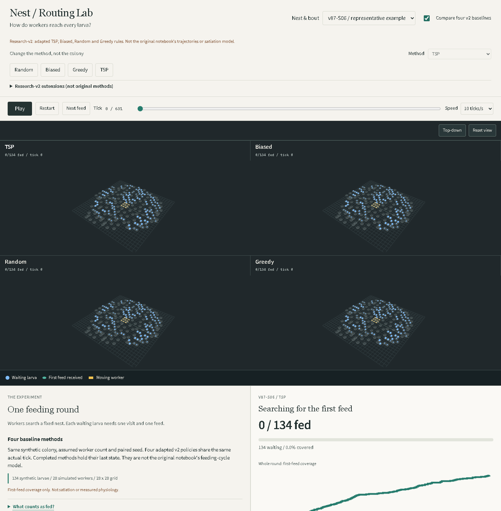

# Research-v2 Review (Archived)

This review applies to the `research-v2-first-feed` tag only. Current v3 changes
the feeding endpoint by explicit user request; see `ACCEPTANCE.md` and the new
README for active behavior and evidence. The observations below remain historical.

Reviewed 2026-09-30 by two independent, read-only agent lanes: scientific fidelity and visual/interaction correctness. These are tool-assisted reviews, not external biological peer review or a claim of human professional credentials.

## Findings And Repairs

| Finding | Consequence | Repair / evidence |
|---|---|---|
| Titles and legend overlapped rendered nests | Agents could be hidden behind text | One render-region contract reserves each panel header; legend sits outside the canvas. Both renderers and picking use the same regions. |
| Sticky playback covered lower comparison panels | Controls obscured the simulation while scrolling | Playback is in normal document flow before the simulation. |
| Waiting larvae and workers both looked orange | Identity and feeding state were ambiguous | Waiting blue `#80bfff`, first-fed teal `#51b5a1`, workers gold `#f5c451`; distinct body shapes. One palette drives 3D, 2D and legend. |
| Method names concealed the version boundary | V2 could be mistaken for the original notebook | Familiar four identifiers restored; visible adapted-model notice; local-information policies separately disclosed. |
| Dataset activity was called resources | Suggested food was measured or simulated | Wording now says assumed worker-count scaling. No food stock or transport is modeled. |
| Source checksum could look like raw-data validation | Public readers could overestimate provenance | Code checksum limitations are explicit. Local preprocessing was separately compared with saved inventories and every bout summary. |

## What Changed Between Models

Research-v2 is not simply a presentation upgrade of `proto_1_reworked.ipynb`.
The prototype can move and feed in one activation and move diagonally toward a
target. Its hunger changes over time; repeated feeds or a low-hunger threshold
support its satiation endpoint. V2 instead permits one cardinal move **or** one
first feed **or** one broadcast per activation, and uses fixed random initial
priority. Consequently its completion time and coverage cannot be treated as
the prototype's feeding-cycle results.

The TSP family still uses nearest-neighbour tours, not an optimal TSP solver.
The persistent-walk family retains a 25% redraw rule, but activation timing and
RNG draw order differ. Random walks also differ in draw ordering and action
timing. V2 Greedy uses initial priority and Manhattan distance; prototype Greedy
uses a richer changing score. The legacy-derived helper is itself not identical
to every earlier prototype cell. Preserved legacy HTML exports and the archived
notebooks remain reference artifacts, not interchangeable implementations.

No scientific engine, private CSV, saved experiment or notebook was changed in
this repair. The display and documentation now state the differences instead of
claiming original-model fidelity. Legacy players are copied unchanged during
production builds, not regenerated from the newer engine.

## What Is Real

- Observed: source nest cell coordinates, stage labels and grouped bout metadata.
- Derived: scaled colonies, jittered/grid-mapped coordinates and assumed staffing.
- Synthetic: stage-random initial hunger, worker motion, targets, broadcasts and first feeds.
- Illustrative: depth, body shapes and scene lighting; no biological 3D reconstruction.

Local source audit rebuilt `run_research.prepare()` from both private CSV files:
the three inventories and all 36 public scenario records exactly matched
`research_results.json`. Public readers can inspect derived reports and code,
but cannot independently verify withheld raw datasets. Code digests do not hash
every trace or browser asset. Reproducibility is not biological calibration.

## Acceptance Evidence

- [x] RED overlap assertion reproduced the original legend/canvas collision.
- [x] Thirteen browser tests pass, including desktop, 2D and portrait comparison geometry, colors, six method filters, all selected nest traces, full completion, seeking, inspection and preserved-player delivery.
- [x] Production build includes four byte-identical preserved legacy HTML players.
- [x] Source-grounding audit: three nests, 36 bouts, scaled larvae 68 / 106 / 134.

Local playback: 24 renders/s, approximately 36.9 MiB JS heap and nine geometries.
This is not total browser process RAM or a guarantee for every GPU. One renderer,
DPR cap 1.5 and lazy legacy-page loading retain the 16 GB device budget.

